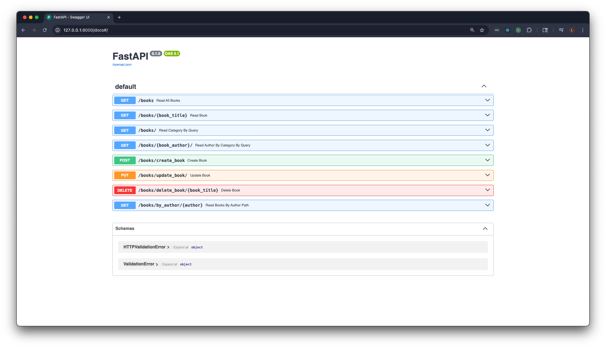

# 📚 FastAPI Book Management API

A simple FastAPI app demonstrating how to build and manage a basic book catalog using core FastAPI concepts.

---


## ✅ What This Covers

- **Path Parameters**  
  e.g., `/books/{title}` to get a specific book

- **Query Parameters**  
  e.g., `/books/?category=Fantasy` to filter books by category

- **Combined Path & Query**  
  e.g., `/books/{author}/?category=Fantasy` to filter by both

- **Request Body with `Body()`**  
  Used in POST and PUT for creating and updating books

- **CRUD Operations**  
  On an in-memory list of book dictionaries

---

## 📘 API Endpoints

| Method | Endpoint | Purpose |
|--------|----------|---------|
| `GET`  | `/books` | Return all books |
| `GET`  | `/books/{book_title}` | Get a single book by title |
| `GET`  | `/books/?category=...` | Filter books by category |
| `GET`  | `/books/{book_author}/?category=...` | Filter by author and category |
| `GET`  | `/books/by_author/{author}` | Get all books by author |
| `POST` | `/books/create_book` | Add a new book |
| `PUT`  | `/books/update_book/` | Update a book by title |
| `DELETE` | `/books/delete_book/{book_title}` | Delete a book by title |

---

## 📝 Example Request Body

```json
{
  "title": "Sample Book",
  "author": "Jane Doe",
  "category": "Mystery"
}
```

---